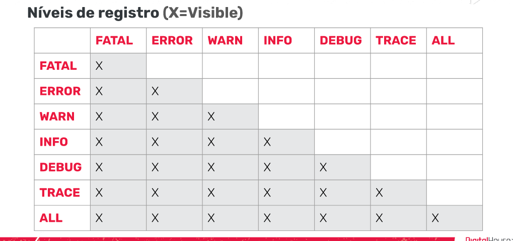

# javaLogging

* Para gerar logs, precisamos adicionar um arquivo de configuração. Vamos adiciona-lo na raiz do projeto, ou seja, na pasta
principal. 

#### LOG4J 
* é uma Biblioteca Java desenvolvida pela Apacha Software Foundation que permite os desenvolvedores escolher a saida
e o nivel de granularidade de mensagem ou logs em tempo de execucao. Ou seja, é utilizado para gerar mensagens de logging de 
forma limpa e simples, permitindo que sejam filtradas por importancia e podendo configurar sua saída por console, arquivo
dentre outros.

* VANTAGENS:
  * Permite ter um registro do que esta acontecendo em nossos sistemas, o que nos possibilita entender melhor os erros

* DESVANTAGENS:
  * Os arquivos as vezes ficam muito grandes e ocupam muita espacos. Por isso devemos escolher bem o tipo de informacao
que queremos armazenar.
  

* TIPOS DE OBJETOS
  * A API Log4j segue uma arquitetura em camadas, onde cada uma fornece objetos diferentes para realizar tarefas diferentes.
Essa estrutura torna o design flexível e fácil de expandir no futuro.

* Objetos core: Esses são objetos obrigatórios que suportam a execução do framework.
  * Logger object
  * Appender object
  * Layout object

* Objetos de suporte: São objetos que podem fornecer recursos adicionais importantes.
  * Level object
  * LogManager
  * Filter object
  * Object render

NIVEIS DE REGISTRO

Por padrão, o Log4j possui níveis de prioridade para mensagens, entre eles:

- OFF: Este é o nível de detalhe mínimo, ele desabilita todos os logs;
- FATAL: É usado para mensagens críticas do sistema, geralmente depois de salvar a mensagem, o programa fecha;
- ERROR: Indica eventos de erro que ainda podem permitir que o aplicativo continue em execução;
-  WARN: É usado para mensagens de alerta sobre eventos;
-  INFO: Refere-se a mensagens informativas que destacam o andamento da aplicação em um nível aproximado;
- DEBUG: Designa os eventos informativos detalhados mais úteis para depurar uma aplicação;
- TRACE: É usado para exibir mensagens com um nível de detalhe mais alto do que a depuração (debug);
- ALL: É o nível máximo de detalhe. Habilita todos os logs.

